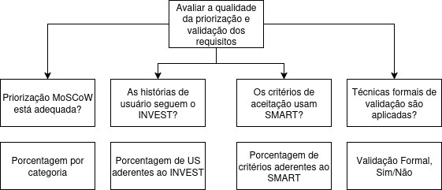

# Modelo GQM

O modelo GQM (Goal-Question-Metric) é uma abordagem estruturada para definir e aplicar métricas em projetos de software. Seu principal objetivo é garantir que as medições realizadas estejam diretamente alinhadas com os objetivos do projeto, promovendo clareza, foco e rastreabilidade na análise da qualidade.

A estrutura do GQM é composta por três níveis:

- **Goal (Objetivo):** Define o que se deseja alcançar ou compreender — por exemplo, avaliar a qualidade da priorização dos requisitos ou a clareza das histórias de usuário.
- **Question (Questão):** Desdobra o objetivo em perguntas específicas que orientam a análise.
- **Metric (Métrica):** Especifica quais dados serão coletados para responder objetivamente às questões formuladas.

No contexto do AgroMart, o modelo GQM foi utilizado para estruturar a avaliação da qualidade dos requisitos e funcionalidades da plataforma. Essa abordagem permitiu à equipe alinhar a coleta de dados com os objetivos reais do projeto, garantindo que os resultados obtidos sirvam de base para decisões mais fundamentadas ao longo do desenvolvimento.

---

## Fase de definição

Objetivo de Medição Geral do AGROMART:

| Campo                 | Descrição                                         |
| :-------------------- | :------------------------------------------------ |
| **Analisar:** | AgroMart                                          |
| **Para o propósito de:** | Avaliar os requisitos                               |
| **Com respeito a:** | Verificar o processo de elicitação e análise dos requisitos |
| **Do ponto de vista dos:** | Desenvolvedor/Engenheiro de software                |
| **No contexto de:** | Qualidade de software                               |

---

## Objetivo de Medição 1: Priorização MoSCoW

<table border="1">
  <tr>
    <td>Analisar</td>
    <td>os requisitos do AgroMart</td>
  </tr>
  <tr>
    <td>Para o propósito de</td>
    <td>Avaliar a estratégia de priorização</td>
  </tr>
  <tr>
    <td>Com respeito a</td>
    <td>a distribuição de categorias MoSCoW</td>
  </tr>
  <tr>
    <td>Do ponto de vista do</td>
    <td>desenvolvedor/engenheiro de software</td>
  </tr>
  <tr>
    <td>No contexto de</td>
    <td>qualidade de requisitos</td>
  </tr>
</table>

**Goal**: Avaliar a priorização dos requisitos funcionais utilizando a técnica MoSCoW, com o propósito de garantir uma seleção equilibrada e estratégica das funcionalidades.

**Questions**:

1. A classificação de prioridade do RF faz sentido considerando o valor que esse recurso oferece ao usuário?
2. A distribuição dos requisitos entre as categorias MoSCoW está balanceada?
3. Os requisitos "Must" estão claramente justificados como essenciais para o funcionamento mínimo do sistema?

**Métricas**:

- **Métrica 1:** Porcentagem de requisitos por categoria (Must, Should, Could, Won't).
- **Métrica 2:** Número de "Must" com justificativa clara de negócio.

---

## Objetivo de Medição 2: Qualidade das Histórias de Usuário (INVEST)

<table border="1">
  <tr>
    <td>Analisar</td>
    <td>as Histórias de Usuário do AgroMart</td>
  </tr>
  <tr>
    <td>Para o propósito de</td>
    <td>Avaliar a aderência aos princípios INVEST</td>
  </tr>
  <tr>
    <td>Com respeito a</td>
    <td>sua independência, negociabilidade, valor, estimabilidade, tamanho e testabilidade</td>
  </tr>
  <tr>
    <td>Do ponto de vista do</td>
    <td>desenvolvedor/engenheiro de software</td>
  </tr>
  <tr>
    <td>No contexto de</td>
    <td>qualidade de requisitos ágeis</td>
  </tr>
</table>

**Goal**: Analisar as histórias de usuário do AgroMart, com o propósito de verificar a aderência aos critérios INVEST e garantir a clareza e granularidade apropriadas para o desenvolvimento incremental.

**Questions**:

1. As histórias de usuário demonstram uma abstração do requisito permitindo analisar como uma funcionalidade que permeia a utilização do produto pelo usuário.
2. As histórias de usuário estão aderentes a todos os critérios INVEST (Independente, Negociável, Valiosa, Estimável, Pequena, Testável)?

**Métricas**:

- **Métrica 3:** Qualidade das Histórias de Usuário (INVEST) - ou, mais precisamente, Porcentagem de Histórias de Usuário que atendem a todos os critérios INVEST.

---

## Objetivo de Medição 3: Clareza dos Critérios de Aceitação (SMART)

<table border="1">
  <tr>
    <td>Analisar</td>
    <td>os critérios de aceitação do AgroMart</td>
  </tr>
  <tr>
    <td>Para o propósito de</td>
    <td>Garantir que sejam claros e verificáveis</td>
  </tr>
  <tr>
    <td>Com respeito a</td>
    <td>a aplicação dos princípios SMART</td>
  </tr>
  <tr>
    <td>Do ponto de vista do</td>
    <td>desenvolvedor/engenheiro de software</td>
  </tr>
  <tr>
    <td>No contexto de</td>
    <td>qualidade de requisitos</td>
  </tr>
</table>

**Goal**: Avaliar os critérios de aceitação das histórias de usuário do AgroMart, com o propósito de assegurar que sejam claros, objetivos e testáveis, sustentando a implementação e verificação.

**Questions**:

1. Os critérios de aceitação das histórias de usuário são claros, objetivos e testáveis garantindo métricas que sustentam a implementação e verificação?
2. Os critérios de aceitação aderem aos princípios SMART (Específico, Mensurável, Alcançável, Relevante, Temporal)?

**Métricas**:

- **Métrica 4:** Clareza dos Critérios de Aceitação (SMART) - ou, mais precisamente, Porcentagem de critérios de aceitação que atendem a todos os princípios SMART.

---

## Objetivo de Medição 4: Eficácia das Técnicas de Validação de Requisitos

<table border="1">
  <tr>
    <td>Analisar</td>
    <td>as técnicas de validação de requisitos do AgroMart</td>
  </tr>
  <tr>
    <td>Para o propósito de</td>
    <td>Determinar sua suficiência e formalidade</td>
  </tr>
  <tr>
    <td>Com respeito a</td>
    <td>o alinhamento com as boas práticas da Engenharia de Requisitos</td>
  </tr>
  <tr>
    <td>Do ponto de vista do</td>
    <td>desenvolvedor/engenheiro de software</td>
  </tr>
  <tr>
    <td>No contexto de</td>
    <td>qualidade do processo de requisitos</td>
  </tr>
</table>

**Goal**: Verificar as técnicas de validação de requisitos utilizadas no projeto AgroMart, com o propósito de determinar sua suficiência e alinhamento com as boas práticas da Engenharia de Requisitos.

**Questions**:

1. As técnicas de validação utilizadas no projeto são suficientes sob a perspectiva dos processos da Engenharia de Requisitos?
2. Existe a adoção de um checklist estruturado com critérios claros para a validação dos requisitos (ex: baseado em INVEST/SMART)?

**Métricas**:

- **Métrica 5:** Eficácia das Técnicas de Validação de Requisitos - ou, mais precisamente, Nível de formalidade e abrangência das técnicas de validação (qualitativa).

---

## Níveis de pontuação das métricas

### Métrica 1: Porcentagem de Requisitos por Categoria (MoSCoW)
Contexto da análise: Atualmente, a distribuição é: 81% 'Must', 0% 'Should', 4% 'Could', 11% 'Won't'. A hipótese é que 81% 'Must' é elevado e enfraquece a priorização, indicando um desequilíbrio significativo.

Níveis de Pontuação:

- Excelente: MoSCoW bem balanceado (ex: Must 40-50%, Should 20-30%, Could 15-20%, Won't 5-10%).

- Bom: Variações aceitáveis do excelente, mas com leve desequilíbrio (ex: Must 50-60%, Should 15-20%).

- Regular: Desequilíbrio significativo, mas com todas as categorias presentes (ex: Must 60-70%, Should <10%).

- Insatisfatório: Grande desequilíbrio ou categorias ausentes/excessivas, como a situação atual com 81% 'Must' e 0% 'Should'.

---

### Métrica 2: Número de 'Must' com Justificativa Clara de Negócio
Contexto da análise: Nenhum dos requisitos "Must" tem justificativa explícita.

Níveis de Pontuação:

- Excelente: 90-100% dos 'Must' com justificativas claras e explícitas.

- Bom: 70-89% dos 'Must' com justificativas claras.

- Regular: 40-69% dos 'Must' com justificativas.

- Insatisfatório: Menos de 40% dos 'Must' com justificativas ou justificativas ausentes/pouco claras, como a situação atual.

---

### Métrica 3: Qualidade das Histórias de Usuário (Critérios INVEST)
Contexto da análise: Várias Histórias de Usuário (US's) não atendem aos critérios de "Independente", "Pequena" e "Testável".

Métrica implícita: Porcentagem de US's que atendem a todos os critérios INVEST.

Níveis de Pontuação:

- Excelente: 90-100% das US's aderem a todos os critérios INVEST.
  
- Bom: 70-89% das US's aderem.
  
- Regular: 40-69% das US's aderem.
  
- Insatisfatório: Menos de 40% das US's aderem.

---

### Métrica 4: Qualidade dos Critérios de Aceitação (Técnica SMART)
Contexto da análise: Muitos critérios de aceitação foram classificados como 'X' ou '?' para "Específico", "Mensurável", "Alcançável", "Relevante" e "Temporal".

Métrica implícita: Porcentagem de critérios de aceitação que atendem a todos os princípios SMART.

Níveis de Pontuação:

- Excelente: 90-100% dos critérios de aceitação são SMART.
  
- Bom: 70-89% dos critérios de aceitação são SMART.
  
- Regular: 40-69% dos critérios de aceitação são SMART.
  
- Insatisfatório: Menos de 40% dos critérios de aceitação são SMART.

--- 

### Métrica 5: Técnicas de Validação dos Requisitos
Contexto da análise: Apenas validação informal foi identificada no contexto de histórias de usuário, MoSCoW e SMART. Existem técnicas formais, mas que não englobam essa parte. O checklist existente pode ser aprimorado.

Métrica implícita: Nível de formalidade e abrangência das técnicas de validação.

Níveis de Pontuação:

- Excelente: Uso de validação formal (ex: revisões por pares, prototipagem com feedback estruturado) e checklist abrangente (INVEST/SMART).
  
- Bom: Validação informal complementada por um checklist robusto.
  
- Regular: Uso de validação informal e checklist básico/incompleto.
  
- Insatisfatório: Apenas validação informal, sem checklist ou com checklist deficiente.

## Critérios para julgamento

- Priorização de Requisitos (MoSCoW):
    - Julgamento "Satisfatório": Se a distribuição da MoSCoW estiver no nível "Excelente" ou "Bom" e a maioria dos "Must" tiver justificativa clara.
    - Julgamento "Necessita Melhoria": Se a distribuição da MoSCoW estiver no nível "Regular" ou se uma porcentagem significativa de "Must" não tiver justificativa clara.
    - Julgamento "Crítico": Se a distribuição da MoSCoW estiver no nível "Insatisfatório" (como o cenário atual) e quase nenhum "Must" tiver justificativa.
- Qualidade das Histórias de Usuário (INVEST):
    - Julgamento "Satisfatório": Se a porcentagem de US's que atendem a INVEST estiver no nível "Excelente" ou "Bom".
    - Julgamento "Necessita Melhoria": Se a porcentagem de US's que atendem a INVEST estiver no nível "Regular".
    - Julgamento "Crítico": Se a porcentagem de US's que atendem a INVEST estiver no nível "Insatisfatório".
- Qualidade dos Critérios de Aceitação (SMART):
    - Julgamento "Satisfatório": Se a porcentagem de critérios de aceitação que são SMART estiver no nível "Excelente" ou "Bom".
    - Julgamento "Necessita Melhoria": Se a porcentagem de critérios de aceitação que são SMART estiver no nível "Regular".
    - Julgamento "Crítico": Se a porcentagem de critérios de aceitação que são SMART estiver no nível "Insatisfatório".
- Técnicas de Validação de Requisitos:
    - Julgamento "Satisfatório": Se forem utilizadas técnicas formais e um checklist abrangente.
    - Julgamento "Necessita Melhoria": Se a validação for predominantemente informal, mas com um checklist em evolução.
    - Julgamento "Crítico": Se a validação for apenas informal e sem um checklist eficaz, como a situação atual.

## Gráfico Hierárquico do GQM

## Tabela de contribuição

| Matrícula   | Nome completo                          | Contribuição (%) |
|-------------|--------------------------------------|------------------|
| 221022462   | [Arthur da Silveira Sousa](https://github.com/Tutzs)           | 16,6             |
| 221022515   | [Danilo Naves do Nascimento](https://github.com/DaniloNavesS)  | 16,6             |
| 180100271   | [Emivalto da Costa Tavares Junior](https://github.com/EmivaltoJrr) | 16,6         |
| 222014859   | [Ian Costa Guimarães](https://github.com/iancostag)            | 16,6             |
| 200020323   | [Jefferson Sena Oliveira](https://github.com/JeffersonSenaa)   | 16,6             |
| 211062016   | [José André Rabelo Rocha](https://github.com/joseandre25)      | 16,6             |
